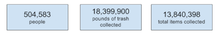

# Trash Talk: A Look at the Garbage Accumulating in Our Oceans

A Christmas tree and lights, a wizard hat, a tennis racket — no, Santa didn’t come early this year. These items were all found in the sea during the Ocean Conservancy’s [2016 International Coastal Cleanup](https://oceanconservancy.org/wp-content/uploads/2017/06/2017_ICC_Report_.pdf). 

Held annually over the past 30 years, this annual clean-up mobilizes people to pick up trash from the shores, while also utilizing citizen science to keep a record of just how much trash is picked up and what exactly it consists of. Some of the stranger items that were found in the most recent clean-up include 56 toilets, five selfie-sticks and one piano. More seriously, however, the results also showed that the most common items continue to be cigarette butts, plastic beverage bottles, and plastic bags. 

And overall, the survey results provide a key glimpse into just how much trash is accumulating in the ocean — and the results are alarming. This year alone, over 500,000 people from 112 different countries, picked up 13,840,398 items of trash dumped into the ocean, totaling nearly 18.4 million pounds. Since 1985, a total of 228,919,809 pounds of trash has been collected as part of the coastal clean-up. Clearly, we have a trash problem. 

Of course this survey doesn’t even touch on the [massive trash vortex](http://www.greenpeace.org/international/en/campaigns/oceans/fit-for-the-future/pollution/trash-vortex/) in the North Pacific — a mass of garbage the size of Texas that rotates as it collects additional plastic, trash and dead animals. 

The increasing amount of trash in our oceans has even caught the attention of Congress. At the beginning of the month, the Senate [passed the Save Our Seas Act](https://oceanconservancy.org/blog/2017/08/07/senate-passes-save-seas-act/), which calls on the State Department to collaborate with other countries to reduce marine debris, and reauthorizes the National Oceanic and Atmospheric Administration’s Marine Debris Program for another five years. After the recess, the House is set to discuss the bill. 

### So just how does the U.S. stack up when it comes to trash in our oceans?

In the most recent 2016 clean-up, over 183,321 people in the United States participated. That number, however, is down 10% from 2015 when 204,022 people participated. This difference in participants may also explain why the number of items collected was also lower in 2016, with just over 4.28 millions items picked up in 2016 compared to 4.9 million in 2015. 
But while the variability in volunteers makes it difficult to determine if less trash has been ending up in the ocean, there are important trends that emerge. For example, cigarette butts were by far the most-collected item across both years (this trend was also mirrored on the global level as well). 

In addition, plastic items — including soda bottles, straws, bags and packaging — were all among the most found items. The impact of plastic on sea creatures has been well documented as well. For example, marine biologists have had to remove straws from the noses of sea turtles, and a recent study has also found that schools of fish are starting to confuse small bits of plastic debris for food. 

### What’s next?

While the data from the Ocean Conservancy’s International Coastal Clean-up provides an insightful glimpse into marine debris in our oceans, more comprehensive data is needed to track trash trends over time. In light of this, the Ocean Conservancy has teamed up with NOAA to work to analyze the 30-year data set and provide a debris density baseline for the U.S. NOAA has also launched their own year-round citizen science project where people can track and input where and what kind of trash they have picked up from our shores. 

One thing that does become abundantly clear from the current available data, however, is that we have a problem with plastics. And policy does seem to be responding to that fact.  In recent years, states like California, and cities across the country are increasingly banning plastic bags. There has also been a movement among restaurants to ban plastic straws. Continued monitoring of marine debris is necessary to see if measures like these are actually having an impact.
