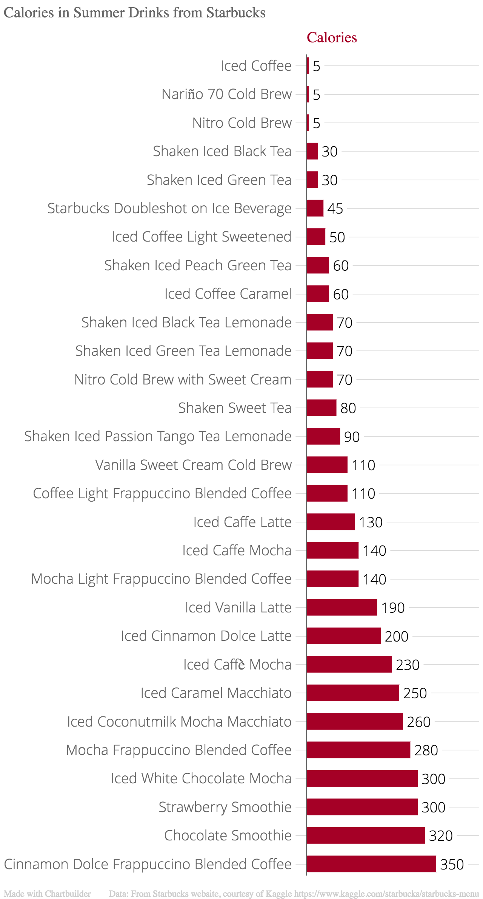

On a hot summer day, there’s nothing more refreshing than getting your caffeine fix in the form of an icy Starbucks drink (mocha Frappuccino, anyone?). But, the chain’s cold beverages can range anywhere from 5 to 350 calories for a Grande (16oz). While there’s nothing wrong with indulging, if you’re trying to watch your diet it can be useful to know just how many calories that oh-so-delicious Cinnamon Dolce Frappuccino contains. 

